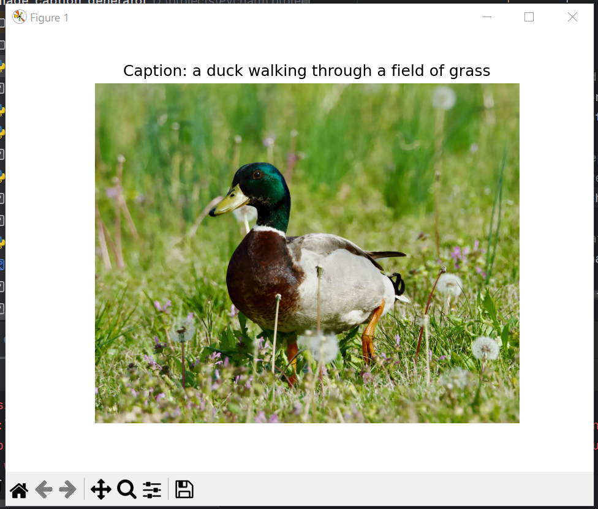

# 🖼️ Image Caption Generator (BLIP + Streamlit)

This project implements an AI-based Image Captioning system using the **BLIP model** from Hugging Face. Built with **Streamlit**, it allows real-time caption generation for uploaded images in a clean, web-based interface.

---

## 🚀 Features
- 🔍 Uses BLIP (Bootstrapped Language-Image Pretraining) for state-of-the-art captioning
- 📦 Powered by Hugging Face Transformers
- 💻 Streamlit web app — runs locally or deploys online
- 🖼️ Upload any image and get a smart AI-generated caption instantly

---

## 💻 Tech Stack
| Tool         | Purpose                    |
|--------------|----------------------------|
| Python       | Core programming language  |
| Streamlit    | Front-end for the app      |
| Hugging Face | BLIP model and inference   |
| Torch        | Backend deep learning lib  |
| PIL          | Image processing           |

---

## ⚙️ How to Run Locally
### 1. Clone this repository
```bash
git clone https://github.com/Navalakshme/image-caption-generator-blip.git
cd image-caption-generator-blip
```

### 2. Install dependencies
```bash
pip install -r requirements.txt
```

### 3. Run the Streamlit app
```bash
streamlit run generate_caption.py
```

---

### Sample Caption Generated



*Caption: a duck walking through a field of grass*

---

## 📦 Requirements.txt Example
```txt
streamlit
transformers
torch
Pillow
```

---

## 🔗 Deploy Online (Optional)
You can deploy this app using [Streamlit Cloud](https://streamlit.io/cloud):
- Create a free account
- Connect your GitHub repo
- Select `generate_caption.py` as the main file
- Hit “Deploy” ✅

---

## 👩‍💻 Author
**Navalakshme S R**  
B.E. in Artificial Intelligence & Data Science

---


